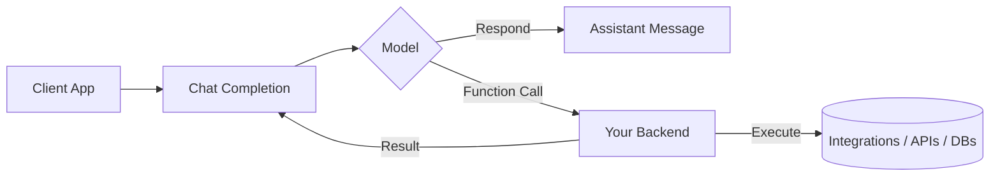

This page gives you a quick mental model for how Incredible works end to end.

Key points:
- The model can respond directly or emit function calls.
- Your backend executes functions and returns results to continue the conversation.
- Integrations allow actions in external apps securely on behalf of users.

